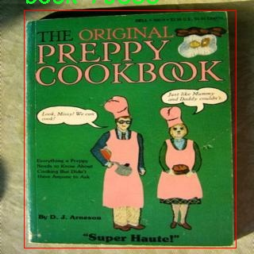

# 书籍检测检测系统源码分享
 # [一条龙教学YOLOV8标注好的数据集一键训练_70+全套改进创新点发刊_Web前端展示]

### 1.研究背景与意义

项目参考[AAAI Association for the Advancement of Artificial Intelligence](https://gitee.com/qunmasj/projects)

项目来源[AACV Association for the Advancement of Computer Vision](https://kdocs.cn/l/cszuIiCKVNis)

研究背景与意义

随着信息技术的迅猛发展，数字化阅读逐渐成为人们获取知识的重要方式。然而，纸质书籍在文化传承、教育和学术研究中依然占据着不可替代的地位。为了有效管理和检索书籍资源，尤其是在图书馆、书店及个人藏书中，书籍检测技术的研究显得尤为重要。传统的书籍管理方法往往依赖人工分类和查找，效率低下且容易出错。近年来，计算机视觉技术的快速进步为书籍检测提供了新的解决方案，其中基于深度学习的目标检测算法，如YOLO（You Only Look Once），因其高效性和准确性而受到广泛关注。

YOLOv8作为YOLO系列的最新版本，进一步提升了目标检测的性能，其在处理复杂场景、实时检测和多目标识别方面表现出色。然而，针对特定领域的应用，如书籍检测，YOLOv8的标准模型可能并不能完全满足需求。因此，基于YOLOv8的改进书籍检测系统的研究具有重要的理论价值和实际意义。

本研究将使用一个包含2070张图像的“all-books”数据集，专注于书籍这一单一类别的检测。该数据集的构建为模型的训练和评估提供了丰富的样本，能够有效提升模型在书籍检测任务中的泛化能力。通过对YOLOv8进行改进，我们可以针对书籍的特征进行优化，例如在模型中引入针对书籍封面、书脊和书页的特征提取机制，以提高检测的准确性和鲁棒性。此外，改进后的模型将能够在不同的环境下，如书店、图书馆和家庭等场景中，进行高效的书籍识别和定位。

本研究的意义不仅在于提升书籍检测的技术水平，更在于推动智能图书管理系统的发展。通过实现高效、准确的书籍检测，能够为图书馆和书店提供更为便捷的库存管理和顾客服务，降低人工成本，提高工作效率。同时，个人用户也能够通过该系统更方便地管理自己的书籍收藏，提升阅读体验。

此外，随着人工智能技术的不断进步，书籍检测系统的应用前景广阔。该系统不仅可以用于传统的图书管理，还可以扩展到在线书籍推荐、智能搜索和虚拟书架等多种场景。通过对书籍的自动识别和分类，用户可以更快速地找到所需书籍，提升信息获取的效率。

综上所述，基于改进YOLOv8的书籍检测系统的研究，不仅在技术上具有创新性，更在实际应用中具有广泛的前景和深远的影响。通过该研究，我们希望能够为书籍管理领域提供新的解决方案，推动相关技术的发展，并为未来的智能图书管理系统奠定基础。

### 2.图片演示


##### 注意：由于此博客编辑较早，上面“2.图片演示”和“3.视频演示”展示的系统图片或者视频可能为老版本，新版本在老版本的基础上升级如下：（实际效果以升级的新版本为准）

  （1）适配了YOLOV8的“目标检测”模型和“实例分割”模型，通过加载相应的权重（.pt）文件即可自适应加载模型。

  （2）支持“图片识别”、“视频识别”、“摄像头实时识别”三种识别模式。

  （3）支持“图片识别”、“视频识别”、“摄像头实时识别”三种识别结果保存导出，解决手动导出（容易卡顿出现爆内存）存在的问题，识别完自动保存结果并导出到tempDir中。

  （4）支持Web前端系统中的标题、背景图等自定义修改，后面提供修改教程。

  另外本项目提供训练的数据集和训练教程,暂不提供权重文件（best.pt）,需要您按照教程进行训练后实现图片演示和Web前端界面演示的效果。

### 3.视频演示

[3.1 视频演示](https://www.bilibili.com/video/BV12x4uecEhB/)

### 4.数据集信息展示

##### 4.1 本项目数据集详细数据（类别数＆类别名）

nc: 1
names: ['book']


##### 4.2 本项目数据集信息介绍

数据集信息展示

在本研究中，我们采用了名为“all-books”的数据集，以训练和改进YOLOv8的书籍检测系统。该数据集专注于书籍这一特定类别，旨在提升计算机视觉模型在书籍识别和定位任务中的性能。数据集的类别数量为1，且唯一的类别名称为“book”。这一设计简化了模型的训练过程，使其能够专注于识别书籍的特征，而不受其他类别的干扰。

“all-books”数据集的构建考虑到了多样性和代表性，涵盖了不同类型、尺寸和封面的书籍。数据集中包含了各种书籍的图像，这些书籍不仅包括小说、教科书、参考书籍，还包括杂志和电子书的封面。这种多样性确保了模型在实际应用中能够处理不同风格和格式的书籍，从而提高了其泛化能力。

数据集中的图像经过精心挑选和标注，确保每张图像中的书籍都被准确地框定和标识。标注过程中，使用了高质量的标注工具，以确保每个书籍的边界框都尽可能精确。这种精确的标注对于YOLOv8模型的训练至关重要，因为模型需要学习如何在复杂的背景中识别和定位书籍。

在数据集的预处理阶段，我们对图像进行了标准化处理，包括调整图像尺寸、增强对比度和色彩平衡等。这些处理步骤旨在提高模型的训练效率和检测精度。此外，为了增强模型的鲁棒性，我们还采用了数据增强技术，如随机裁剪、旋转和翻转等。这些技术能够有效扩展训练数据集的多样性，使模型在面对不同环境和条件时，仍能保持良好的识别性能。

在训练过程中，我们将“all-books”数据集分为训练集和验证集，以便在模型训练的不同阶段进行性能评估。训练集用于模型的学习，而验证集则用于监测模型的泛化能力，确保其在未见过的数据上也能表现良好。通过这种方式，我们能够不断调整模型的参数，优化其性能。

总的来说，“all-books”数据集为YOLOv8的书籍检测系统提供了一个坚实的基础。通过对数据集的精心设计和处理，我们期望模型能够在书籍检测任务中实现高准确率和高召回率。这不仅将推动书籍识别技术的发展，也为图书馆、书店及在线书籍平台等应用场景提供了强有力的技术支持。随着研究的深入，我们相信这一数据集将为未来的书籍检测系统提供更多的可能性和创新空间。





### 5.全套项目环境部署视频教程（零基础手把手教学）

[5.1 环境部署教程链接（零基础手把手教学）](https://www.ixigua.com/7404473917358506534?logTag=c807d0cbc21c0ef59de5)


[5.2 安装Python虚拟环境创建和依赖库安装视频教程链接（零基础手把手教学）](https://www.ixigua.com/7404474678003106304?logTag=1f1041108cd1f708b01a)

### 6.手把手YOLOV8训练视频教程（零基础小白有手就能学会）

[6.1 手把手YOLOV8训练视频教程（零基础小白有手就能学会）](https://www.ixigua.com/7404477157818401292?logTag=d31a2dfd1983c9668658)


按照上面的训练视频教程加载项目提供的数据集，运行train.py即可开始训练



     Epoch   gpu_mem       box       obj       cls    labels  img_size
     1/200     20.8G   0.01576   0.01955  0.007536        22      1280: 100%|██████████| 849/849 [14:42<00:00,  1.04s/it]
               Class     Images     Labels          P          R     mAP@.5 mAP@.5:.95: 100%|██████████| 213/213 [01:14<00:00,  2.87it/s]
                 all       3395      17314      0.994      0.957      0.0957      0.0843

     Epoch   gpu_mem       box       obj       cls    labels  img_size
     2/200     20.8G   0.01578   0.01923  0.007006        22      1280: 100%|██████████| 849/849 [14:44<00:00,  1.04s/it]
               Class     Images     Labels          P          R     mAP@.5 mAP@.5:.95: 100%|██████████| 213/213 [01:12<00:00,  2.95it/s]
                 all       3395      17314      0.996      0.956      0.0957      0.0845

     Epoch   gpu_mem       box       obj       cls    labels  img_size
     3/200     20.8G   0.01561    0.0191  0.006895        27      1280: 100%|██████████| 849/849 [10:56<00:00,  1.29it/s]
               Class     Images     Labels          P          R     mAP@.5 mAP@.5:.95: 100%|███████   | 187/213 [00:52<00:00,  4.04it/s]
                 all       3395      17314      0.996      0.957      0.0957      0.0845


### 7.70+种全套YOLOV8创新点代码加载调参视频教程（一键加载写好的改进模型的配置文件）

[7.1 70+种全套YOLOV8创新点代码加载调参视频教程（一键加载写好的改进模型的配置文件）](https://www.ixigua.com/7404478314661806627?logTag=29066f8288e3f4eea3a4)

### 8.70+种全套YOLOV8创新点原理讲解（非科班也可以轻松写刊发刊，V10版本正在科研待更新）

#### 由于篇幅限制，每个创新点的具体原理讲解就不一一展开，具体见下列网址中的创新点对应子项目的技术原理博客网址【Blog】：


[8.1 70+种全套YOLOV8创新点原理讲解链接](https://gitee.com/qunmasj/good)

#### 部分改进原理讲解(完整的改进原理见上图和技术博客链接)
### 可变性卷积DCN简介
卷积神经网络由于其构建模块中固定的几何结构，本质上受限于模型几何变换。为了提高卷积神经网络的转换建模能力，《Deformable Convolutional Networks》作者提出了两个模块：可变形卷积（deformable convolution）和可变形RoI池（deformable RoI pooling）。这两个模块均基于用额外的偏移来增加模块中的空间采样位置以及从目标任务中学习偏移的思想，而不需要额外的监督。

第一次证明了在深度神经网络中学习密集空间变换（dense spatial transformation）对于复杂的视觉任务是有效的

视觉识别中的一个关键挑战是如何适应对象比例、姿态、视点和零件变形中的几何变化或模型几何变换。一般有两种方法实现：
1）建立具有足够期望变化的训练数据集。这通常通过增加现有的数据样本来实现，例如通过仿射变换。但是训练成本昂贵而且模型参数庞大。
2）使用变换不变（transformation-invariant）的特征和算法。比如比较有名的SIFT(尺度不变特征变换)便是这一类的代表算法。

但以上的方法有两个缺点：
1）几何变换被假定为固定的和已知的，这些先验知识被用来扩充数据，设计特征和算法。为此，这个假设阻止了对具有未知几何变换的新任务的推广，从而导致这些几何变换可能没有被正确建模。
2）对于不变特征和算法进行手动设计，对于过于复杂的变换可能是困难的或不可行的。

卷积神经网络本质上局限于模拟大型未知转换。局限性源于CNN模块的固定几何结构：卷积单元在固定位置对输入特征图进行采样；池化层以固定比率降低特征矩阵分辨率；RoI（感兴趣区域）池化层将RoI分成固定的空间箱（spatial bins）等。缺乏处理几何变换的内部机制。

这种内部机制的缺乏会导致一些问题，举个例子。同一个CNN层中所有激活单元的感受野大小是相同的，但是这是不可取的。因为不同的位置可能对应于具有不同尺度或变形的对象，所以尺度或感受野大小的自适应确定对于具有精细定位的视觉识别是渴望的。

对于这些问题，作者提出了两个模块提高CNNs对几何变换建模的能力。


deformable convolution（可变形卷积）
将2D偏移量添加到标准卷积中的常规网格采样位置，使得采样网格能够自由变形。通过额外的卷积层，从前面的特征映射中学习偏移。因此，变形采用局部、密集和自适应的方式取决于输入特征。


deformable RoI pooling（可变形RoI池化）
为先前RoI池化的常规库（bin）分区中的每个库位置（bin partition）增加了一个偏移量。类似地，偏移是从前面的特征图和感兴趣区域中学习的，从而能够对具有不同形状的对象进行自适应部件定位（adaptive part localization）。

#### Deformable Convolutional Networks
Deformable Convolution
2D卷积由两个步骤组成：
1）在输入特征图x xx上使用规则网格R RR进行采样。
2）把这些采样点乘不同权重w ww后相加。

网格R定义感受野大小和扩张程度，比如内核大小为3x3，扩张程度为1的网格R可以表示为：
R = { ( − 1 , − 1 ) , ( − 1 , 0 ) , … , ( 0 , 1 ) , ( 1 , 1 ) } R = \{(-1,-1),(-1,0),\dots,(0,1),(1,1)\}
R={(−1,−1),(−1,0),…,(0,1),(1,1)}

​
 一般为小数，使用双线性插值进行处理。（把小数坐标分解到相邻的四个整数坐标点来计算结果）


具体操作如图所示：


首先对输入特征层进行一个普通的3x3卷积处理得到偏移域（offset field）。偏移域特征图具有与输入特征图相同的空间分辨率，channels维度2N对应于N个2D（xy两个方向）偏移。其中的N是原输入特征图上所具有的N个channels，也就是输入输出channels保持不变，这里xy两个channels分别对输出特征图上的一个channels进行偏移。确定采样点后就通过与相对应的权重w点乘相加得到输出特征图上该点最终值。

前面也提到过，由于这里xy两个方向所训练出来的偏移量一般来说是一个小数，那么为了得到这个点所对应的数值，会采用双线性插值的方法，从最近的四个邻近坐标点中计算得到该偏移点的数值，公式如下：


具体推理过程见：双线性插值原理

#### Deformable RoI Poolingb
所有基于区域提议（RPN）的对象检测方法都使用RoI池话处理，将任意大小的输入矩形区域转换为固定大小的特征图。


 一般为小数，需要使用双线性插值进行处理。


具体操作如图所示：


当时看这个部分的时候觉得有些突兀，明明RoI池化会将特征层转化为固定尺寸的区域。其实，我个人觉得，这个部分与上述的可变性卷积操作是类似的。这里同样是使用了一个普通的RoI池化操作，进行一些列处理后得到了一个偏移域特征图，然后重新作用于原来的w × H w \times Hw×H的RoI。只不过这里不再是规律的逐行逐列对每个格子进行池化，而是对于格子进行偏移后再池化处理。

#### Postion﹣Sensitive RoI Pooling
除此之外，论文还提出一种PS RoI池化（Postion﹣Sensitive RoI Pooling）。不同于上述可变形RoI池化中的全连接过程，这里使用全卷积替换。

具体操作如图所示：


首先，对于原来的特征图来说，原本是将输入特征图上的RoI区域分成k × k k\times kk×k个bin。而在这里，则是将输入特征图进行卷积操作，分别得到一个channels为k 2 ( C + 1 ) k^{2}(C+1)k (C+1)的得分图（score maps）和一个channels为2 k 2 ( C + 1 ) 2k{2}(C+1)2k 2 (C+1)的偏移域（offset fields），这两个特征矩阵的宽高是与输入特征矩阵相同的。其中，得分图的channels中，k × k k \times kk×k分别表示的是每一个网格，C CC表示的检测对象的类别数目，1表示背景。而在偏移域中的2表示xy两个方向的偏移。
也就是说，在PS RoI池化中，对于RoI的每一个网格都独自占一个通道形成一层得分图，然后其对于的偏移量占两个通道。offset fields得到的偏移是归一化后的偏移，需要通过和deformable RoI pooling中一样的变换方式得到∆ p i j ∆p_{ij}∆p ij，然后对每层得分图进行偏移池化处理。最后处理完的结果就对应着最后输出的一个网格。所以其包含了位置信息。

原文论述为：


#### Understanding Deformable ConvNets
当可变形卷积叠加时，复合变形的效果是深远的。如图所示：


ps：a是标准卷积的固定感受野，b是可变形卷积的适应性感受野。

感受野和标准卷积中的采样位置在整个顶部特征图上是固定的(左)。在可变形卷积中，它们根据对象的比例和形状进行自适应调整(右)。


### 9.系统功能展示（检测对象为举例，实际内容以本项目数据集为准）

图9.1.系统支持检测结果表格显示

  图9.2.系统支持置信度和IOU阈值手动调节

  图9.3.系统支持自定义加载权重文件best.pt(需要你通过步骤5中训练获得)

  图9.4.系统支持摄像头实时识别

  图9.5.系统支持图片识别

  图9.6.系统支持视频识别

  图9.7.系统支持识别结果文件自动保存

  图9.8.系统支持Excel导出检测结果数据


### 10.原始YOLOV8算法原理

原始YOLOv8算法原理

YOLOv8作为YOLO系列的最新版本，于2023年1月发布，标志着计算机视觉领域目标检测和实例分割技术的又一次重大进步。该模型不仅在精度和速度上超越了其前辈，还融合了多种先进的设计理念，成为了实时目标检测的佼佼者。YOLOv8的设计理念在于保持简洁易用的同时，全面提升模型的性能，使其在多种硬件平台上均能高效运行。

YOLOv8的核心创新之一是其骨干网络的改进。与YOLOv5相比，YOLOv8在卷积层的设计上进行了优化，首次将卷积核的大小从6x6缩小至3x3。这一变化不仅减小了计算量，还提升了特征提取的精度，使得模型在处理细节丰富的图像时表现更加出色。此外，YOLOv8将原有的C3模块替换为新的C2f模块，C2f模块通过引入更多的跳层连接和分支结构，增强了特征的流动性和梯度的回传效率。这种结构的调整使得YOLOv8在处理复杂场景时，能够更好地捕捉到多层次的特征信息。

在特征融合方面，YOLOv8依然采用了FPN（特征金字塔网络）和PAN（路径聚合网络）的结合结构。这一结构的设计使得多尺度信息能够得到充分融合，从而提升了模型对不同尺寸目标的检测能力。通过将C3模块替换为C2f模块，YOLOv8在特征融合的过程中，能够更有效地整合来自不同层次的特征，进而提升了检测的准确性和鲁棒性。

YOLOv8在检测头的设计上也进行了重大创新。传统的YOLO系列模型使用耦合头，即通过一层卷积同时完成分类和定位任务，而YOLOv8则采用了解耦头结构。这一结构将分类和定位任务分开处理，各自使用独立的卷积层进行特征提取。这种解耦设计不仅提高了模型的灵活性，还能够更好地适应不同类型的目标检测任务，提升了整体的检测性能。

标签分配策略的改进也是YOLOv8的一大亮点。YOLOv8不再依赖于候选框的聚类策略，而是采用了一种动态标签分配策略。这种策略通过使用目标边界框和目标分数，简化了正负样本的匹配过程。与YOLOX的SimOTA不同，YOLOv8采用了与YOLOv6相似的TOOD策略，使得标签分配更加灵活和高效。这一变化使得模型在面对复杂数据集时，能够更准确地分配标签，从而提升了检测的精度。

在损失函数的设计上，YOLOv8引入了Varifocal Loss（VFL）和CIoU Loss的组合形式。VFL通过不对称参数对正负样本进行加权，强调了高质量正样本对模型训练的重要性。具体而言，当正样本的GTIoU（真实交并比）较高时，其对损失的贡献也会相应增加，从而引导模型更好地聚焦于高质量样本的学习。而对于负样本，VFL则通过降低其对损失的贡献，减轻了负样本对模型训练的干扰。这种设计使得YOLOv8在训练过程中能够更加有效地平衡正负样本的影响，从而提升了模型的整体性能。

此外，YOLOv8在数据预处理方面也延续了YOLOv5的策略，采用了多种数据增强手段，如马赛克增强、混合增强、空间扰动和颜色扰动等。这些增强手段的使用，使得模型在训练过程中能够更好地适应各种复杂场景，提升了模型的泛化能力。

总的来说，YOLOv8通过对骨干网络、特征融合、检测头、标签分配策略和损失函数等多个方面的创新和改进，达到了实时目标检测领域的新高度。其在精度和速度上的显著提升，使得YOLOv8成为了计算机视觉领域中最先进的模型之一，具有广泛的应用前景。无论是在智能监控、自动驾驶还是机器人视觉等领域，YOLOv8都将发挥重要作用，为相关技术的发展提供强有力的支持。


### 11.项目核心源码讲解（再也不用担心看不懂代码逻辑）

#### 11.1 70+种YOLOv8算法改进源码大全和调试加载训练教程（非必要）\ultralytics\utils\instance.py

以下是对代码的核心部分进行提炼和详细注释的结果：

```python
import numpy as np

# 定义一个用于处理边界框的类
class Bboxes:
    """
    处理边界框的类，支持多种格式（'xyxy', 'xywh', 'ltwh'）。
    
    属性:
        bboxes (numpy.ndarray): 存储边界框的二维数组。
        format (str): 边界框的格式（'xyxy', 'xywh', 或 'ltwh'）。
    """

    def __init__(self, bboxes, format='xyxy') -> None:
        """初始化 Bboxes 类，设置边界框数据和格式。"""
        # 确保格式有效
        assert format in ['xyxy', 'xywh', 'ltwh'], f'无效的边界框格式: {format}'
        # 处理一维数组为二维数组
        bboxes = bboxes[None, :] if bboxes.ndim == 1 else bboxes
        assert bboxes.ndim == 2 and bboxes.shape[1] == 4, "边界框必须是二维数组，且每个框包含4个值"
        self.bboxes = bboxes
        self.format = format

    def convert(self, format):
        """将边界框格式从一种类型转换为另一种类型。"""
        assert format in ['xyxy', 'xywh', 'ltwh'], f'无效的边界框格式: {format}'
        if self.format == format:
            return  # 如果格式相同，则不进行转换
        
        # 根据当前格式和目标格式选择转换函数
        if self.format == 'xyxy':
            func = xyxy2xywh if format == 'xywh' else xyxy2ltwh
        elif self.format == 'xywh':
            func = xywh2xyxy if format == 'xyxy' else xywh2ltwh
        else:
            func = ltwh2xyxy if format == 'xyxy' else ltwh2xywh
        
        # 执行转换
        self.bboxes = func(self.bboxes)
        self.format = format

    def areas(self):
        """返回每个边界框的面积。"""
        self.convert('xyxy')  # 确保转换为 'xyxy' 格式
        # 计算面积: (右下角x - 左上角x) * (右下角y - 左上角y)
        return (self.bboxes[:, 2] - self.bboxes[:, 0]) * (self.bboxes[:, 3] - self.bboxes[:, 1])

    def __len__(self):
        """返回边界框的数量。"""
        return len(self.bboxes)

    @classmethod
    def concatenate(cls, boxes_list: List['Bboxes'], axis=0) -> 'Bboxes':
        """
        将多个 Bboxes 对象合并为一个 Bboxes 对象。
        
        参数:
            boxes_list (List[Bboxes]): 要合并的 Bboxes 对象列表。
            axis (int, optional): 合并的轴，默认为0。
        
        返回:
            Bboxes: 包含合并后边界框的新 Bboxes 对象。
        """
        assert isinstance(boxes_list, (list, tuple)) and boxes_list, "输入必须是非空的 Bboxes 列表或元组"
        assert all(isinstance(box, Bboxes) for box in boxes_list), "所有元素必须是 Bboxes 实例"

        # 合并边界框
        return cls(np.concatenate([b.bboxes for b in boxes_list], axis=axis))

    def __getitem__(self, index) -> 'Bboxes':
        """
        使用索引获取特定的边界框或一组边界框。
        
        参数:
            index (int, slice, or np.ndarray): 选择所需边界框的索引、切片或布尔数组。
        
        返回:
            Bboxes: 包含所选边界框的新 Bboxes 对象。
        """
        b = self.bboxes[index]
        assert b.ndim == 2, f'索引 {index} 返回的结果不是二维矩阵!'
        return Bboxes(b)  # 返回选中的边界框

# 实例类，包含边界框、分段和关键点
class Instances:
    """
    存储图像中检测到的对象的边界框、分段和关键点的容器。
    
    属性:
        _bboxes (Bboxes): 处理边界框操作的内部对象。
        keypoints (ndarray): 关键点数组，形状为 [N, 17, 3]。
        segments (ndarray): 分段数组，形状为 [N, 1000, 2]。
    """

    def __init__(self, bboxes, segments=None, keypoints=None, bbox_format='xywh', normalized=True) -> None:
        """初始化 Instances 对象，设置边界框、分段和关键点。"""
        self._bboxes = Bboxes(bboxes=bboxes, format=bbox_format)  # 初始化边界框
        self.keypoints = keypoints
        self.normalized = normalized

        # 处理分段数据
        if segments is None:
            segments = []
        self.segments = np.stack(segments, axis=0) if segments else np.zeros((0, 1000, 2), dtype=np.float32)

    def convert_bbox(self, format):
        """转换边界框格式。"""
        self._bboxes.convert(format=format)

    @property
    def bbox_areas(self):
        """计算边界框的面积。"""
        return self._bboxes.areas()

    def __getitem__(self, index) -> 'Instances':
        """
        使用索引获取特定实例或一组实例。
        
        参数:
            index (int, slice, or np.ndarray): 选择所需实例的索引、切片或布尔数组。
        
        返回:
            Instances: 包含所选边界框、分段和关键点的新 Instances 对象。
        """
        segments = self.segments[index] if len(self.segments) else self.segments
        keypoints = self.keypoints[index] if self.keypoints is not None else None
        bboxes = self._bboxes[index]
        bbox_format = self._bboxes.format
        return Instances(bboxes=bboxes, segments=segments, keypoints=keypoints, bbox_format=bbox_format, normalized=self.normalized)

    def __len__(self):
        """返回实例列表的长度。"""
        return len(self._bboxes)
```

### 代码核心部分分析
1. **Bboxes 类**:
   - 该类用于处理边界框，支持不同的格式（`xyxy`, `xywh`, `ltwh`）。
   - 提供了初始化、格式转换、面积计算、合并和索引获取等功能。

2. **Instances 类**:
   - 该类用于存储和处理图像中检测到的对象的边界框、分段和关键点。
   - 提供了初始化、格式转换、面积计算、索引获取等功能。

### 代码注释
注释详细解释了每个方法的功能、参数和返回值，帮助理解代码的结构和逻辑。

这个文件是一个用于处理边界框（bounding boxes）的Python模块，主要用于计算机视觉任务中，特别是在YOLO（You Only Look Once）目标检测算法中。该模块定义了两个主要的类：`Bboxes`和`Instances`，它们分别用于处理边界框和图像中检测到的对象的实例。

`Bboxes`类主要用于管理边界框的不同格式，包括`xyxy`（左上角和右下角坐标）、`xywh`（中心坐标和宽高）以及`ltwh`（左上角坐标和宽高）。在初始化时，`Bboxes`类会验证输入的格式，并确保边界框数据是一个二维的NumPy数组。该类提供了多种方法，包括格式转换、计算面积、缩放、添加偏移量等。特别地，`convert`方法可以将边界框从一种格式转换为另一种格式，`areas`方法则计算所有边界框的面积。

`Instances`类则是一个更高级的容器，除了包含边界框外，还可以存储对象的分割（segments）和关键点（keypoints）。在初始化时，`Instances`类会创建一个`Bboxes`对象来处理边界框，并可以选择性地处理分割和关键点数据。该类提供了一些方法来转换边界框格式、缩放和归一化坐标、添加填充、裁剪到图像边界等。

这两个类的设计使得它们可以灵活地处理各种与目标检测相关的数据，并且能够在不同的坐标系统之间进行转换。此外，`Instances`类还提供了方便的索引和拼接功能，使得可以轻松地处理多个实例的边界框、分割和关键点数据。

总的来说，这个模块为YOLO目标检测算法提供了基础的数据结构和操作，帮助开发者更高效地处理和分析图像中的目标检测结果。

#### 11.2 ui.py

```python
import sys
import subprocess

def run_script(script_path):
    """
    使用当前 Python 环境运行指定的脚本。

    Args:
        script_path (str): 要运行的脚本路径

    Returns:
        None
    """
    # 获取当前 Python 解释器的路径
    python_path = sys.executable

    # 构建运行命令，使用 streamlit 运行指定的脚本
    command = f'"{python_path}" -m streamlit run "{script_path}"'

    # 执行命令
    result = subprocess.run(command, shell=True)
    # 检查命令执行的返回码，如果不为0则表示出错
    if result.returncode != 0:
        print("脚本运行出错。")

# 实例化并运行应用
if __name__ == "__main__":
    # 指定要运行的脚本路径
    script_path = "web.py"  # 这里可以直接指定脚本路径

    # 运行脚本
    run_script(script_path)
```

### 代码核心部分及注释说明：

1. **导入模块**：
   - `import sys`：用于访问与 Python 解释器相关的变量和函数。
   - `import subprocess`：用于执行外部命令和程序。

2. **定义 `run_script` 函数**：
   - 该函数接收一个参数 `script_path`，表示要运行的 Python 脚本的路径。
   - 使用 `sys.executable` 获取当前 Python 解释器的路径，以确保使用正确的 Python 环境来运行脚本。
   - 构建一个命令字符串，使用 `streamlit` 模块运行指定的脚本。
   - 使用 `subprocess.run` 执行构建的命令，并通过 `shell=True` 允许在 shell 中执行命令。
   - 检查命令的返回码，如果返回码不为0，表示脚本运行出错，打印错误信息。

3. **主程序块**：
   - 在 `if __name__ == "__main__":` 中，确保只有在直接运行该脚本时才会执行以下代码。
   - 指定要运行的脚本路径（在这里是 `web.py`）。
   - 调用 `run_script` 函数，传入脚本路径以执行该脚本。

这个程序文件的主要功能是通过当前的 Python 环境来运行一个指定的脚本，具体是一个名为 `web.py` 的文件。程序首先导入了必要的模块，包括 `sys`、`os` 和 `subprocess`，这些模块提供了与系统交互和执行外部命令的功能。此外，还从 `QtFusion.path` 导入了 `abs_path` 函数，用于获取脚本的绝对路径。

在 `run_script` 函数中，首先获取当前 Python 解释器的路径，这通过 `sys.executable` 实现。接着，构建一个命令字符串，这个命令将使用 `streamlit` 模块来运行指定的脚本。具体来说，命令的格式是 `"{python_path}" -m streamlit run "{script_path}"`，其中 `python_path` 是当前 Python 解释器的路径，`script_path` 是要运行的脚本的路径。

然后，使用 `subprocess.run` 函数来执行这个命令。这个函数会在一个新的 shell 中运行命令，并等待其完成。如果命令执行的返回码不为 0，表示脚本运行出错，程序会打印出相应的错误信息。

在文件的最后部分，使用 `if __name__ == "__main__":` 语句来确保只有在直接运行该文件时才会执行后面的代码。在这里，调用 `abs_path` 函数来获取 `web.py` 的绝对路径，并将其传递给 `run_script` 函数以启动脚本的运行。

总的来说，这个程序的目的是为了方便地在当前 Python 环境中运行一个 Streamlit 应用，确保路径的正确性并处理可能出现的错误。

#### 11.3 code\ultralytics\assets\utils\__init__.py

以下是经过简化和注释的核心代码部分：

```python
from sys import version_info as py_version  # 导入Python版本信息

def __pyarmor__():
    import platform  # 导入平台模块
    import sys  # 导入系统模块
    from struct import calcsize  # 导入结构体模块中的calcsize函数

    # 格式化系统信息
    def format_system():
        # 获取操作系统名称并转换为小写
        plat = platform.system().lower()
        # 根据操作系统名称进行归类
        plat = ('windows' if plat.startswith('cygwin') else
                'linux' if plat.startswith('linux') else
                'freebsd' if plat.startswith(
                    ('freebsd', 'openbsd', 'isilon onefs')) else plat)
        # 进一步细分Linux平台
        if plat == 'linux':
            if hasattr(sys, 'getandroidapilevel'):  # 检查是否为Android
                plat = 'android'
            else:
                cname, cver = platform.libc_ver()  # 获取C库信息
                if cname == 'musl':  # 检查C库类型
                    plat = 'alpine'
                elif cname == 'libc':
                    plat = 'android'
        return plat  # 返回处理后的平台名称

    # 格式化机器架构信息
    def format_machine():
        mach = platform.machine().lower()  # 获取机器架构并转换为小写
        # 定义机器架构与别名的映射关系
        arch_table = (
            ('x86', ('i386', 'i486', 'i586', 'i686')),
            ('x86_64', ('x64', 'x86_64', 'amd64', 'intel')),
            ('arm', ('armv5',)),
            ('armv6', ('armv6l',)),
            ('armv7', ('armv7l',)),
            ('aarch32', ('aarch32',)),
            ('aarch64', ('aarch64', 'arm64'))
        )
        # 遍历映射关系，查找匹配的架构
        for alias, archlist in arch_table:
            if mach in archlist:
                mach = alias  # 找到匹配则更新架构名称
                break
        return mach  # 返回处理后的机器架构名称

    # 获取平台和机器架构信息
    plat, mach = format_system(), format_machine()
    # 特殊处理Windows x86_64架构
    if plat == 'windows' and mach == 'x86_64':
        bitness = calcsize('P'.encode()) * 8  # 计算指针大小（位数）
        if bitness == 32:
            mach = 'x86'  # 如果是32位，则将架构设置为x86

    # 生成模块名称
    name = '.'.join(['py%d%d' % py_version[:2], '_'.join([plat, mach]), 'pyarmor_runtime'])
    # 动态导入生成的模块
    return __import__(name, globals(), locals(), ['__pyarmor__'], level=1)

# 将__pyarmor__函数重新赋值为调用结果
__pyarmor__ = __pyarmor__().__pyarmor__
```

### 代码说明：
1. **导入模块**：导入必要的模块以获取系统和平台信息。
2. **format_system()**：该函数用于获取当前操作系统的名称，并根据特定条件进行分类。
3. **format_machine()**：该函数用于获取当前机器的架构，并将其转换为通用名称（如x86、x86_64等）。
4. **获取平台和架构信息**：调用上述两个函数以获取当前的操作系统和机器架构。
5. **特殊处理**：对Windows系统的x86_64架构进行特殊处理，以确定其位数。
6. **动态导入模块**：根据获取的系统和架构信息生成模块名称，并动态导入该模块。

这个程序文件的主要功能是根据当前系统的环境信息动态导入一个模块，通常用于处理与平台相关的功能。代码首先从 `sys` 模块中导入了 Python 版本信息，然后定义了一个名为 `__pyarmor__` 的函数。

在 `__pyarmor__` 函数内部，首先导入了 `platform`、`sys` 和 `struct` 模块。接着定义了两个内部函数：`format_system` 和 `format_machine`。

`format_system` 函数用于获取当前操作系统的名称。它将操作系统名称转换为小写，并根据不同的前缀将其归类为 'windows'、'linux'、'freebsd' 等。如果系统是 Linux，还会进一步检查是否是 Android 系统或 Alpine Linux。

`format_machine` 函数则用于获取当前机器的架构类型。它将机器类型转换为小写，并通过一个包含常见架构别名的表来判断当前机器的架构。如果匹配到某个架构，则将机器类型更新为相应的别名。

接下来，代码调用这两个函数，获取当前的操作系统和机器架构信息。如果当前系统是 Windows 且机器架构是 x86_64，代码会计算位数并可能将机器架构更改为 x86。

最后，代码构建了一个模块名称，格式为 `py<major_version><minor_version>_<platform>_<machine>_pyarmor_runtime`，并使用 `__import__` 函数动态导入这个模块。这个模块的导入是为了引入与当前环境相关的功能。

最终，`__pyarmor__` 函数返回的结果是从动态导入的模块中获取的 `__pyarmor__` 属性。这个结构通常用于实现代码的保护或加密功能，确保在不同的环境中都能正确运行。

#### 11.4 train.py

以下是代码中最核心的部分，并附上详细的中文注释：

```python
class DetectionTrainer(BaseTrainer):
    """
    DetectionTrainer类扩展自BaseTrainer类，用于基于检测模型的训练。
    """

    def build_dataset(self, img_path, mode="train", batch=None):
        """
        构建YOLO数据集。

        参数:
            img_path (str): 包含图像的文件夹路径。
            mode (str): 模式，可以是'train'或'val'，用户可以为每种模式自定义不同的增强。
            batch (int, optional): 批次大小，适用于'rect'模式。默认为None。
        """
        gs = max(int(de_parallel(self.model).stride.max() if self.model else 0), 32)
        return build_yolo_dataset(self.args, img_path, batch, self.data, mode=mode, rect=mode == "val", stride=gs)

    def get_dataloader(self, dataset_path, batch_size=16, rank=0, mode="train"):
        """构造并返回数据加载器。"""
        assert mode in ["train", "val"]  # 确保模式是'train'或'val'
        with torch_distributed_zero_first(rank):  # 在分布式环境中，仅初始化一次数据集
            dataset = self.build_dataset(dataset_path, mode, batch_size)
        shuffle = mode == "train"  # 训练模式下打乱数据
        if getattr(dataset, "rect", False) and shuffle:
            LOGGER.warning("WARNING ⚠️ 'rect=True'与DataLoader的shuffle不兼容，设置shuffle=False")
            shuffle = False
        workers = self.args.workers if mode == "train" else self.args.workers * 2  # 根据模式设置工作线程数
        return build_dataloader(dataset, batch_size, workers, shuffle, rank)  # 返回数据加载器

    def preprocess_batch(self, batch):
        """对一批图像进行预处理，包括缩放和转换为浮点数。"""
        batch["img"] = batch["img"].to(self.device, non_blocking=True).float() / 255  # 将图像转移到设备并归一化
        if self.args.multi_scale:  # 如果启用多尺度
            imgs = batch["img"]
            sz = (
                random.randrange(self.args.imgsz * 0.5, self.args.imgsz * 1.5 + self.stride)
                // self.stride
                * self.stride
            )  # 随机选择新的尺寸
            sf = sz / max(imgs.shape[2:])  # 计算缩放因子
            if sf != 1:
                ns = [
                    math.ceil(x * sf / self.stride) * self.stride for x in imgs.shape[2:]
                ]  # 计算新的形状
                imgs = nn.functional.interpolate(imgs, size=ns, mode="bilinear", align_corners=False)  # 进行插值缩放
            batch["img"] = imgs  # 更新批次中的图像
        return batch

    def get_model(self, cfg=None, weights=None, verbose=True):
        """返回YOLO检测模型。"""
        model = DetectionModel(cfg, nc=self.data["nc"], verbose=verbose and RANK == -1)  # 创建检测模型
        if weights:
            model.load(weights)  # 加载权重
        return model

    def get_validator(self):
        """返回用于YOLO模型验证的DetectionValidator。"""
        self.loss_names = "box_loss", "cls_loss", "dfl_loss"  # 定义损失名称
        return yolo.detect.DetectionValidator(
            self.test_loader, save_dir=self.save_dir, args=copy(self.args), _callbacks=self.callbacks
        )

    def plot_training_samples(self, batch, ni):
        """绘制带有注释的训练样本。"""
        plot_images(
            images=batch["img"],
            batch_idx=batch["batch_idx"],
            cls=batch["cls"].squeeze(-1),
            bboxes=batch["bboxes"],
            paths=batch["im_file"],
            fname=self.save_dir / f"train_batch{ni}.jpg",
            on_plot=self.on_plot,
        )
```

### 代码说明
1. **DetectionTrainer类**：这是一个用于训练YOLO检测模型的类，继承自`BaseTrainer`。
2. **build_dataset方法**：构建YOLO数据集，接收图像路径、模式和批次大小作为参数。
3. **get_dataloader方法**：构造数据加载器，确保在分布式环境中只初始化一次数据集，并根据模式设置是否打乱数据。
4. **preprocess_batch方法**：对输入的图像批次进行预处理，包括归一化和可能的缩放。
5. **get_model方法**：返回一个YOLO检测模型，可以选择加载预训练权重。
6. **get_validator方法**：返回用于验证模型的检测验证器。
7. **plot_training_samples方法**：绘制训练样本及其注释，便于可视化训练过程中的数据。

这个程序文件 `train.py` 是一个用于训练 YOLO（You Only Look Once）目标检测模型的实现，继承自 `BaseTrainer` 类。文件中包含了多个方法，用于构建数据集、获取数据加载器、预处理图像批次、设置模型属性、获取模型、进行模型验证、记录损失、显示训练进度、绘制训练样本和绘制训练指标等。

首先，`DetectionTrainer` 类的构造函数定义了如何构建 YOLO 数据集。`build_dataset` 方法接收图像路径、模式（训练或验证）和批次大小，使用 `build_yolo_dataset` 函数创建数据集。这里的 `gs` 变量是模型的最大步幅，用于确保输入图像的尺寸符合模型要求。

`get_dataloader` 方法则负责构建并返回数据加载器。它会根据模式选择是否打乱数据，并设置工作线程的数量。通过 `torch_distributed_zero_first` 方法，确保在分布式训练时只初始化一次数据集缓存。

在 `preprocess_batch` 方法中，对图像批次进行预处理，包括将图像缩放到指定范围并转换为浮点数格式。若启用多尺度训练，图像会被随机缩放到一定范围内。

`set_model_attributes` 方法用于设置模型的属性，包括类别数量和类别名称，以便模型能够正确处理输入数据。

`get_model` 方法返回一个 YOLO 检测模型实例，并可选择加载预训练权重。`get_validator` 方法则返回一个用于模型验证的 `DetectionValidator` 实例。

`label_loss_items` 方法用于返回带有标签的训练损失字典，适用于分割和检测任务。`progress_string` 方法生成一个格式化的字符串，显示训练进度，包括当前的 epoch、GPU 内存使用情况、损失值、实例数量和图像大小。

此外，`plot_training_samples` 方法用于绘制训练样本及其标注，便于可视化训练过程中的数据。最后，`plot_metrics` 和 `plot_training_labels` 方法分别用于绘制训练过程中的指标和标签，帮助分析模型的训练效果。

整体而言，这个文件提供了一个完整的框架，用于训练 YOLO 模型，支持多种功能和灵活的配置选项，以适应不同的训练需求。

#### 11.5 70+种YOLOv8算法改进源码大全和调试加载训练教程（非必要）\ultralytics\models\rtdetr\__init__.py

以下是代码中最核心的部分，并附上详细的中文注释：

```python
# 导入RTDETR模型、预测器和验证器
from .model import RTDETR  # 导入RTDETR模型类
from .predict import RTDETRPredictor  # 导入RTDETR预测器类
from .val import RTDETRValidator  # 导入RTDETR验证器类

# 定义模块的公开接口，允许外部使用这些类
__all__ = 'RTDETRPredictor', 'RTDETRValidator', 'RTDETR'
```

### 详细注释说明：
1. **导入模块**：
   - `from .model import RTDETR`：从当前包的`model`模块中导入`RTDETR`类，这个类通常是用于定义模型的结构和参数。
   - `from .predict import RTDETRPredictor`：从当前包的`predict`模块中导入`RTDETRPredictor`类，这个类负责对输入数据进行预测，通常会调用模型进行推理。
   - `from .val import RTDETRValidator`：从当前包的`val`模块中导入`RTDETRValidator`类，这个类用于验证模型的性能，通常会评估模型在验证集上的表现。

2. **定义公开接口**：
   - `__all__ = 'RTDETRPredictor', 'RTDETRValidator', 'RTDETR'`：这个特殊变量`__all__`定义了当使用`from module import *`时，哪些名称是可以被导入的。这里列出了三个类，表示它们是模块的主要功能部分，外部用户可以直接使用这些类。

这个程序文件是一个Python模块的初始化文件，属于Ultralytics YOLO项目的一部分，主要用于目标检测。文件的开头包含了版权信息，说明该代码遵循AGPL-3.0许可证，这意味着它是开源的，并且用户在使用和修改代码时需要遵循相应的许可证条款。

接下来，文件通过相对导入的方式引入了三个主要的类或功能：`RTDETR`、`RTDETRPredictor`和`RTDETRValidator`。这些类分别位于同一目录下的不同模块中。`RTDETR`可能是一个模型类，负责定义和构建RTDETR目标检测模型；`RTDETRPredictor`则可能是一个用于进行预测的类，提供了模型推理的功能；而`RTDETRValidator`则可能用于验证模型的性能，通常涉及评估模型在测试集上的表现。

最后，`__all__`变量定义了当使用`from module import *`语句时，哪些名称会被导入。这里列出的名称包括`RTDETRPredictor`、`RTDETRValidator`和`RTDETR`，这意味着这三个类是该模块的主要接口，用户可以直接使用它们进行目标检测相关的操作。

总的来说，这个文件的作用是组织和暴露RTDETR模型相关的功能，使得其他模块或用户能够方便地使用这些功能进行目标检测任务。

#### 11.6 code\ultralytics\models\yolo\segment\__init__.py

以下是保留的核心代码部分，并附上详细的中文注释：

```python
# 导入必要的模块
from .predict import SegmentationPredictor  # 导入分割预测器类
from .train import SegmentationTrainer      # 导入分割训练器类
from .val import SegmentationValidator      # 导入分割验证器类

# 定义模块的公开接口，指定可以被外部访问的类
__all__ = "SegmentationPredictor", "SegmentationTrainer", "SegmentationValidator"
```

### 注释说明：
1. **导入模块**：
   - `from .predict import SegmentationPredictor`：从当前包的 `predict` 模块中导入 `SegmentationPredictor` 类，用于进行图像分割的预测。
   - `from .train import SegmentationTrainer`：从当前包的 `train` 模块中导入 `SegmentationTrainer` 类，用于训练分割模型。
   - `from .val import SegmentationValidator`：从当前包的 `val` 模块中导入 `SegmentationValidator` 类，用于验证分割模型的性能。

2. **公开接口**：
   - `__all__` 是一个特殊变量，用于定义当前模块中可以被外部导入的类或函数。这里指定了三个类，意味着当使用 `from module import *` 时，只会导入这三个类。

这个程序文件是一个Python模块的初始化文件，文件名为`__init__.py`，它位于`code/ultralytics/models/yolo/segment/`目录下。这个文件的主要作用是定义该模块的公共接口，并导入与分割相关的类。

首先，文件顶部的注释表明这是Ultralytics YOLO项目的一部分，并且该项目遵循AGPL-3.0许可证。这意味着该代码是开源的，用户可以自由使用和修改，但需要遵循相应的许可证条款。

接下来，文件通过`from`语句导入了三个类：`SegmentationPredictor`、`SegmentationTrainer`和`SegmentationValidator`。这些类分别负责图像分割的预测、训练和验证功能。具体来说：

- `SegmentationPredictor`：这个类可能用于执行图像分割的预测任务，处理输入数据并返回分割结果。
- `SegmentationTrainer`：这个类负责训练分割模型，通常会包含模型的训练过程、损失计算和优化等功能。
- `SegmentationValidator`：这个类用于验证训练好的模型的性能，可能会涉及到评估指标的计算和结果的可视化。

最后，`__all__`变量定义了模块的公共接口，列出了在使用`from module import *`语句时会被导入的类。这里的`__all__`包含了之前导入的三个类的名称，确保了模块的使用者能够清晰地知道可以使用哪些功能。

总体而言，这个`__init__.py`文件的结构简洁明了，主要用于组织和导出与图像分割相关的功能，使得用户在使用该模块时能够方便地访问这些类。

### 12.系统整体结构（节选）

### 整体功能和构架概括

该项目是一个基于YOLOv8目标检测算法的实现，包含了多种改进和扩展功能，旨在为用户提供一个灵活且高效的目标检测和图像分割框架。项目的核心功能包括模型的训练、验证、预测以及数据处理，支持多种目标检测和分割任务。整体架构由多个模块组成，每个模块负责特定的功能，确保代码的可维护性和可扩展性。

- **数据处理**：通过工具类处理边界框和实例数据，支持多种格式的转换和操作。
- **模型训练**：提供训练和验证的功能，支持自定义数据集和多种训练策略。
- **预测与评估**：实现了模型的推理和性能评估，能够生成可视化结果。
- **用户界面**：通过简单的用户界面（如`ui.py`）来运行和管理模型。

### 文件功能整理表

| 文件路径                                                                 | 功能描述                                                                                   |
|--------------------------------------------------------------------------|------------------------------------------------------------------------------------------|
| `ultralytics/utils/instance.py`                                          | 定义`Bboxes`和`Instances`类，用于处理边界框和图像中检测到的对象实例。                          |
| `ui.py`                                                                  | 提供一个用户界面，通过当前Python环境运行指定的`web.py`脚本，方便启动Streamlit应用。         |
| `ultralytics/assets/utils/__init__.py`                                   | 初始化模块，导入与RTDETR模型相关的类（`RTDETR`、`RTDETRPredictor`、`RTDETRValidator`）。     |
| `train.py`                                                               | 实现YOLO模型的训练框架，包括数据集构建、数据加载、模型训练、验证和可视化功能。                |
| `ultralytics/models/rtdetr/__init__.py`                                 | 初始化RTDETR模型模块，导入与分割相关的类。                                               |
| `ultralytics/models/yolo/segment/__init__.py`                          | 初始化YOLO分割模块，导入分割相关的类（`SegmentationPredictor`、`SegmentationTrainer`、`SegmentationValidator`）。 |
| `ultralytics/nn/modules/block.py`                                       | 定义神经网络模块的基本构建块，可能包括卷积层、激活函数等。                                |
| `ultralytics/models/nas/model.py`                                       | 实现神经架构搜索（NAS）相关的模型定义和训练逻辑。                                         |
| `val.py`                                                                 | 实现模型验证的功能，评估模型在测试集上的表现。                                           |
| `ultralytics/utils/callbacks/base.py`                                   | 定义训练过程中的回调函数，用于监控和记录训练状态。                                        |
| `ultralytics/utils/benchmarks.py`                                       | 提供基准测试功能，用于评估模型性能和推理速度。                                            |
| `ultralytics/models/sam/build.py`                                       | 构建SAM（Segment Anything Model）模型的相关功能。                                         |
| `ultralytics/models/rtdetr/predict.py`                                   | 实现RTDETR模型的预测功能，处理输入数据并返回分割结果。                                   |

这个表格总结了每个文件的主要功能，帮助理解项目的整体结构和各个模块之间的关系。

注意：由于此博客编辑较早，上面“11.项目核心源码讲解（再也不用担心看不懂代码逻辑）”中部分代码可能会优化升级，仅供参考学习，完整“训练源码”、“Web前端界面”和“70+种创新点源码”以“13.完整训练+Web前端界面+70+种创新点源码、数据集获取”的内容为准。

### 13.完整训练+Web前端界面+70+种创新点源码、数据集获取


# [下载链接：https://mbd.pub/o/bread/ZpyUl51s](https://mbd.pub/o/bread/ZpyUl51s)